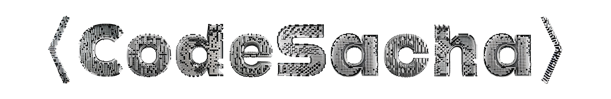

 

 
 

<h2> 〉 about me </h2>
  
- ⭐ currently working on **web and mobile development**
- 💀 a lot of **private repositories**
- 🕹️ a **freelance** working his way around things
- 👾 love **pixel**
  
<h2> 〉 current skills  </h2>
  
- <h4> languages </h4>
  
  
  
  
  
  
- <h4> database </h4>
  

- <h4> frameworks & libraries </h4>
  
  
  
  
  
  

- <h4> hosting </h4>
  
  
  
- <h4> designing tools </h4>
  
  
- <h4> music </h4>
  
  
  
  

 
 

---

